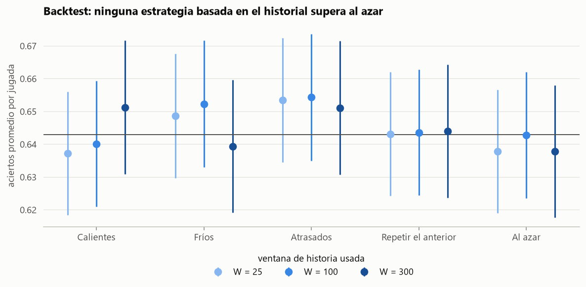
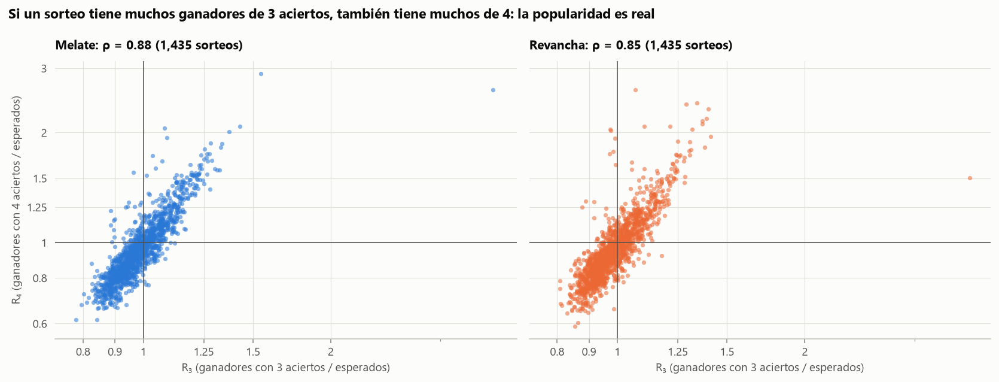
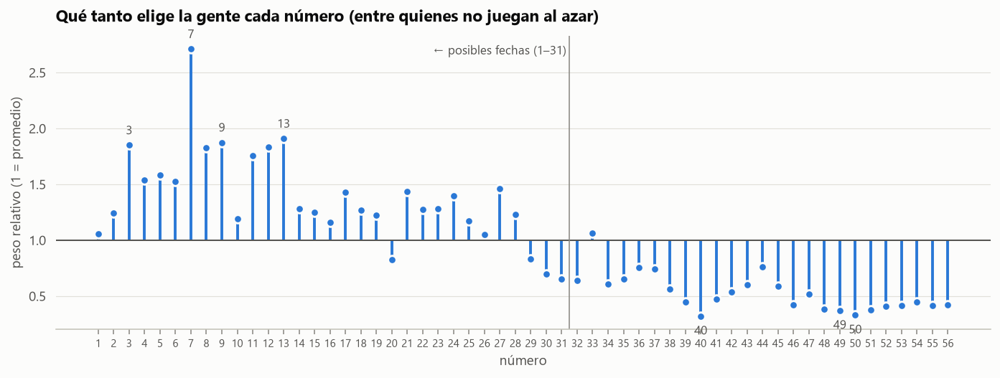

# Proyecto Melate IA · Boleto Poco Jugado

**Autor:** Fernando Hernández Esquivel, en colaboración con Claude (Anthropic).

**App en línea:** https://fernandohernandezesquivel.github.io/Proyecto_Melate_IA/

Análisis estadístico de más de 40 años de sorteos de Melate, Revancha y Revanchita (México) y un modelo que estima **qué tan jugada es cada combinación**. El análisis confirma que es imposible predecir qué números van a salir. Lo que sí se puede elegir es una combinación que poca gente juega, para no compartir el premio si ganas. La app **Boleto Poco Jugado** usa este modelo para sugerir combinaciones poco jugadas y para simular años de juego con premios reales.

## Hallazgos

### 1. Los sorteos son indistinguibles del azar
Se analizaron 4,273 sorteos (1984–2026) y 9,441 combinaciones ganadoras. Se probaron frecuencias, atrasos, parejas, suma, pares/impares, orden de extracción e independencia entre sorteos, y nada se aparta de un sorteo justo. Un backtest de estrategias populares (números calientes, fríos, atrasados, repetir el anterior) acierta lo mismo que elegir al azar.



### 2. Lo que sí varía es cuánta gente juega cada combinación
Con los ganadores por categoría de 1,435 sorteos (2014–2026) se mide la popularidad de cada combinación ganadora. Si salen números que mucha gente juega, hay más ganadores de 3 y 4 aciertos de los esperados. Esa señal es de 5 a 12 veces mayor que el ruido aleatorio, y las dos categorías coinciden (ρ = 0.88).



### 3. Un modelo de cómo elige la gente sus números
El modelo es una mezcla de dos tipos de jugadas:
- ~60% de las combinaciones se juegan **al azar**;
- el resto se elige con un **peso por número**, una penalización por **números consecutivos** y otra por **números en la misma decena**.

Las probabilidades de cada categoría se calculan de forma exacta con programación dinámica, y el modelo se ajusta con pérdida robusta y gradientes de PyTorch. Con sorteos de 2023–2026 que no usó para entrenar, explica **53–56%** de la variación de la popularidad, casi igual que un gradient boosting, pero con 59 parámetros interpretables.

- **Números favoritos:** el **7** (2.7 veces el promedio), seguido del 13, 9, 3, 12 y 8.
- **Menos elegidos:** del 39 al 56 casi nadie los elige.
- **Patrones:** la gente evita los números seguidos y reparte sus números entre decenas.



### 4. Beneficio real, pero acotado
Una combinación del 10% menos jugado cobraría en promedio **~26% más con 4 aciertos y ~36% más con 5** que una combinación al azar.

No cambia la probabilidad de ganar (1 en 32,468,436), el premio mayor, que casi nunca se comparte, ni el hecho de que el boleto devuelve en promedio menos de la mitad de lo que cuesta.

## La app
[`docs/index.html`](docs/index.html) es una sola página HTML/JavaScript sin dependencias, con el modelo incluido:
- **Boleto:** marcas tu combinación y ves al instante su popularidad, su percentil y el premio esperado en 4 y 5 aciertos.
- **Generador:** sugiere combinaciones al azar dentro del 5–25% menos jugado. Excluye secuencias, progresiones y ganadoras anteriores, que el modelo no mide.
- **Simulador:** juega dos combinaciones en los mismos sorteos simulados durante 1–40 años, con los premios reales promedio, y muestra cuánto gastarías, cuánto ganarías y qué pasaría si lo repitieras 1,000 veces.

## Cómo replicarlo
```powershell
python -m venv .venv
.\.venv\Scripts\pip install -r requirements.txt
.\.venv\Scripts\python src\scraper.py            # números de todos los sorteos (~25 min la primera vez)
.\.venv\Scripts\python src\scraper_premios.py    # ganadores por categoría (~80 min; descarga lenta a propósito)
cd notebooks
..\.venv\Scripts\jupyter nbconvert --to notebook --execute --inplace 01_EDA_melate.ipynb
..\.venv\Scripts\jupyter nbconvert --to notebook --execute --inplace 02_premios_y_popularidad.ipynb
..\.venv\Scripts\jupyter nbconvert --to notebook --execute --inplace 03_modelo_popularidad.ipynb --ExecutePreprocessor.timeout=7200
cd ..
.\.venv\Scripts\python src\exportar_app.py       # regenera docs/index.html con el modelo nuevo
.\.venv\Scripts\python src\generar.py -n 5       # sugerencias desde la terminal
```
El repositorio incluye el modelo ya entrenado (`models/popularidad_melate.npz`). La app funciona sin descargar nada, y `generar.py` solo necesita correr antes `src/scraper.py` (lo usa para excluir combinaciones ganadoras anteriores). `exportar_app.py` necesita los dos scrapers.

## Estructura
```
src/scraper.py              números de cada sorteo (resultadosmelate.mx), con caché local
src/scraper_premios.py      ganadores por categoría (melaterevancha.com), una petición cada 5 s
src/datos.py                carga, limpieza de premios e índice de popularidad
src/popularidad.py          modelos de popularidad (programación dinámica + PyTorch)
src/generar.py              sugerir o evaluar combinaciones desde la terminal
src/exportar_app.py         inserta el modelo en app/plantilla.html → docs/index.html
src/estilo.py               estilo común de las gráficas
data/raw/parches_manuales.csv  3 sorteos que la fuente publica vacíos, con su fuente
notebooks/01_EDA_melate.ipynb             análisis exploratorio y pruebas de aleatoriedad
notebooks/02_premios_y_popularidad.ipynb  validación de premios y señal de popularidad
notebooks/03_modelo_popularidad.ipynb     modelo, validación por tiempo y beneficio esperado
models/popularidad_melate.npz             modelo entrenado
app/plantilla.html          código de la app
docs/index.html             app publicada (GitHub Pages)
reports/figures/            gráficas
```

## Datos y aviso
- **Fuentes:** los resultados vienen de [resultadosmelate.mx](https://resultadosmelate.mx) y los ganadores por categoría de [melaterevancha.com](https://www.melaterevancha.com). Los datos descargados no se incluyen en el repositorio; se regeneran con los scrapers.
- **Calidad de la fuente:** tiene errores conocidos (tablas de premios copiadas entre sorteos, 3 sorteos sin números) que se detectan y corrigen en los notebooks.
- **Uso:** es un proyecto personal de análisis estadístico, **sin relación con Lotería Nacional ni con Pronósticos para la Asistencia Pública**. No predice números ganadores. Juega con responsabilidad.

**Tecnologías:** Python, pandas, NumPy, SciPy, statsmodels, scikit-learn, PyTorch, matplotlib y Jupyter; la app está hecha en HTML, CSS y JavaScript sin frameworks.

## Licencia
[MIT](LICENSE) © 2026 Fernando Hernández Esquivel. Puedes usar, modificar y redistribuir el código siempre que conserves el aviso de copyright. La licencia cubre el código del repositorio, no los datos de las fuentes externas.
